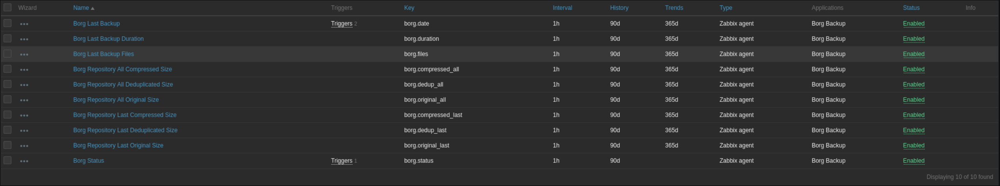
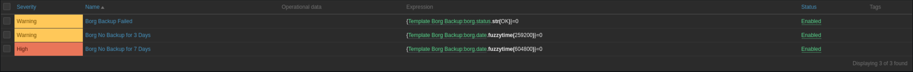

# zabbix-borg
Zabbix Plugin for monitoring Borg Backup

## Items
There are 10 Items:



## Triggers
There are 3 Triggers:



## Install
### Zabbix 
- Import template into zabbix server and configure hosts to use it.
- Deploy zabbix_agentd.conf.d/borg.conf to every machine, you want to use the template.

If you want to test it, use `zabbix_get -s IP -p 10050 -k borg.status`.

### Borg Backup
To let the template work, you must redirect borg output to `/var/log/borg.log`. 
```
borg create --stats ... > /var/log/borg.log 2>&1
```

You can also use borgmatic:
```
borgmatic -c borgbackup.yml -v 1 --stats > /var/log/borg.log 2>&1
```

Second build a script to generate `/var/log/borg.status` like this:
```bash
#! /bin/bash
# check whether a backup was created
grep 'Archive name:' /var/log/borg.log > /dev/null 2>&1
if [ $? -ne 0 ]; then
  echo "$borg backup failed! Exiting"
  echo "$(date +%Y-%m-%d-%H:%M:%S): FAILED" > /var/log/borg.status
  exit 1
fi
# if running consistency checks: Check them
grep 'Starting archive consistency check...' /var/log/borg.log > /dev/null 2>&1
if [ $? -eq 0 ]; then
  grep 'Archive consistency check complete, no problems found.' /var/log/borg.log > /dev/null 2>&1
  if [ $? -ne 0 ]; then
   echo "$borg backup failed! Exiting"
   echo "$(date +%Y-%m-%d-%H:%M:%S): FAILED" > /var/log/borg.status
   exit 1
  fi
fi
# check the size of the currently created archive
ARCHIVESIZE=$(grep 'This archive' /var/log/borg.log |awk '{print $7}')
BC=$(echo $ARCHIVESIZE'>'0| bc -l)
if [ "$BC" -eq 1 ]; then
  echo "OK" > /var/log/borg.status
else
  echo "$(date +%Y-%m-%d-%H:%M:%S): FAILED" > /var/log/borg.status
  exit 1
fi
```
You can achive that by:
- a cron job, which runs the script periodically
- as a second action after you run borg create (e.g. with `&&`)
- as a post run script in borgmatic

Output must be like this:
```
root@mail:~# cat /var/log/borg.status 
OK
```

```
root@mail:~# cat /var/log/borg.log 
Creating archive at "ssh://test@test.de/mnt/borg::mail-2020-03-03-20:02:54"
------------------------------------------------------------------------------
Archive name: mail-2020-03-03-20:02:54
Archive fingerprint: 2067bd6dd2e7bc2a27d373ef293eda59022d84d4f0f8ce860221a5123f77ba7a
Time (start): Tue, 2020-03-03 20:02:58
Time (end):   Tue, 2020-03-03 20:03:36
Duration: 37.84 seconds
Number of files: 277055
Utilization of max. archive size: 0%
------------------------------------------------------------------------------
                       Original size      Compressed size    Deduplicated size
This archive:               40.32 GB             31.61 GB             11.25 MB
All archives:                5.68 TB              4.48 TB             30.36 GB

                       Unique chunks         Total chunks
Chunk index:                  338444             39507784
------------------------------------------------------------------------------
```

or (with consistency checks with borgmatic):

```
ssh://test@test.de/mnt/borg: Pruning archives
------------------------------------------------------------------------------
                       Original size      Compressed size    Deduplicated size
Deleted data:                0.0  B               0.0  B              11.25 MB
All archives:                5.68 TB              4.48 TB             30.36 GB

                       Unique chunks         Total chunks
Chunk index:                  338444             39507784
------------------------------------------------------------------------------
ssh://test@test.de/mnt/borg: Creating archive
Creating archive at "ssh://test@test.de/mnt/borg::mail-2020-03-03-20:02:54"
------------------------------------------------------------------------------
Archive name: mail-2020-03-03-20:02:54
Archive fingerprint: 2067bd6dd2e7bc2a27d373ef293eda59022d84d4f0f8ce860221a5123f77ba7a
Time (start): Tue, 2020-03-03 20:02:58
Time (end):   Tue, 2020-03-03 20:03:36
Duration: 37.84 seconds
Number of files: 277055
Utilization of max. archive size: 0%
------------------------------------------------------------------------------
                       Original size      Compressed size    Deduplicated size
This archive:               40.32 GB             31.61 GB             11.25 MB
All archives:                5.68 TB              4.48 TB             30.36 GB

                       Unique chunks         Total chunks
Chunk index:                  338444             39507784
------------------------------------------------------------------------------
ssh://test@test.de/mnt/borg: Running consistency checks
Starting archive consistency check...
Analyzing archive mail-2020-03-01-20:02:12 (1/3)
Analyzing archive mail-2020-03-02-20:00:15 (2/3)
Analyzing archive mail-2020-03-03-20:02:54 (3/3)
Orphaned objects check skipped (needs all archives checked).
Archive consistency check complete, no problems found.

summary:
borgbackup.yml: Successfully ran configuration file
```
